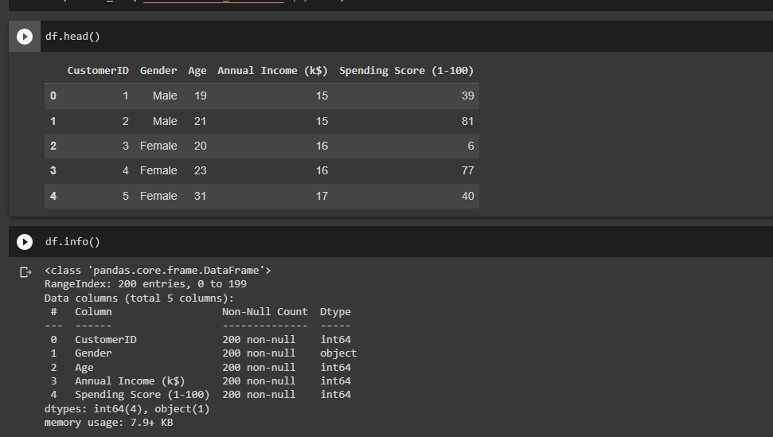
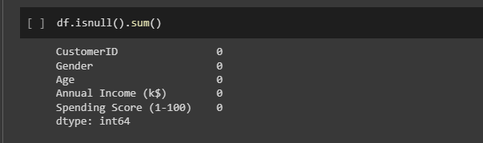
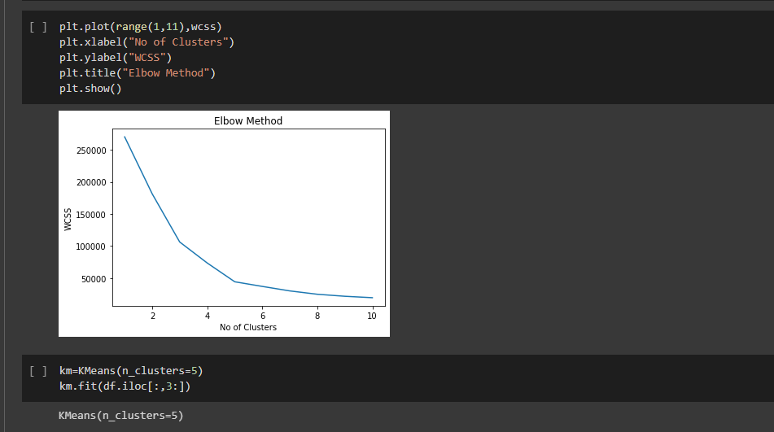
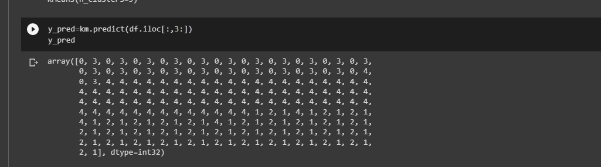
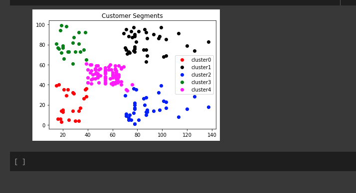

# Implementation-of-K-Means-Clustering-for-Customer-Segmentation

## AIM:
To write a program to implement the K Means Clustering for Customer Segmentation.

## Equipments Required:
1. Hardware – PCs
2. Anaconda – Python 3.7 Installation / Jupyter notebook

## Algorithm
1. Import the dataset and print dataset info 
2. check for null values
3. Import kmeans and fit it to dataset
4. Plot the graph using elbow method
5. Print the predicted array values
6. Plot the customer segments graph

## Program:
```
/*
Program to implement the K Means Clustering for Customer Segmentation.
Developed by: S.THIRISAA
RegisterNumber:  212220040171

import pandas as pd
import matplotlib.pyplot as plt 
df=pd.read_csv('/content/Mall_Customers (1).csv')
df.head()
df.info()
df.isnull().sum()
from sklearn.cluster import KMeans
wcss=[]
for i in range(1,11):
  kmeans=KMeans(n_clusters=i,init="k-means++")
  kmeans.fit(df.iloc[:,3:])
  wcss.append(kmeans.inertia_)
plt.plot(range(1,11),wcss)
plt.xlabel("No of Clusters")
plt.ylabel("WCSS")
plt.title("Elbow Method")
plt.show()
km=KMeans(n_clusters=5)
km.fit(df.iloc[:,3:])
y_pred=km.predict(df.iloc[:,3:])
y_pred
df["cluster"]=y_pred
data0=df[df["cluster"]==0]
data1=df[df["cluster"]==1]
data2=df[df["cluster"]==2]
data3=df[df["cluster"]==3]
data4=df[df["cluster"]==4]
plt.scatter(data0["Annual Income (k$)"],data0["Spending Score (1-100)"],c="red",label="cluster0")
plt.scatter(data1["Annual Income (k$)"],data1["Spending Score (1-100)"],c="black",label="cluster1")
plt.scatter(data2["Annual Income (k$)"],data2["Spending Score (1-100)"],c="blue",label="cluster2")
plt.scatter(data3["Annual Income (k$)"],data3["Spending Score (1-100)"],c="green",label="cluster3")
plt.scatter(data4["Annual Income (k$)"],data4["Spending Score (1-100)"],c="magenta",label="cluster4")
plt.legend()
plt.title("Customer Segments")
plt.show()
*/
```

## Output:







## Result:
Thus the program to implement the K Means Clustering for Customer Segmentation is written and verified using python programming.
